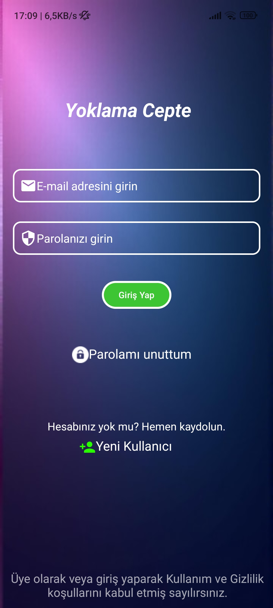

# Pocket-Attendance
Pocket Attendance is a user-friendly app designed to make attendance tracking effortless for teachers and students. With its powerful GPS-based system, Pocket Attendance ensures accurate and secure attendance verification. Say goodbye to manual check-ins and hello to a smarter way to manage classes!

## Screenshots

### Home Screen

This is the home screen where users can see their classes and take attendance.

